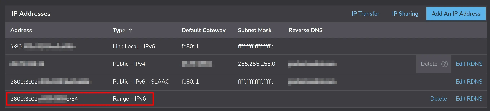
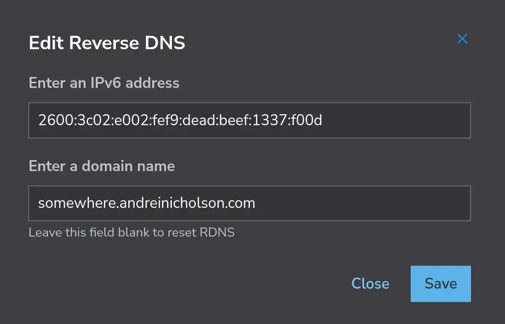

[Spamhaus](https://www.spamhaus.org/) Exploits Blocklist (XBL) lists IPv6 address with [/64 granularity](https://www.spamhaus.org/faqs/exploits-blocklist-xbl/#how-does-xbl-handle-ipv6-addresses). Spammers can cycle through IPv6 addresses every few seconds. Since a /64 address is twice the size of the entire IPv4 mask, they can produce a lot of spam with little effort. So Spamhaus lists the whole /64.

That sounds well and good if you're using their XBL service but can be a real problem if you're running a legitimate email server on [Linode](https://www.linode.com/lp/refer/?r=ea05baeaf43e95fc0851d4ae3b068fe7a22d280e) where Compute instances are [assigned out of a shared /64](https://techdocs.akamai.com/cloud-computing/docs/an-overview-of-ipv6-on-linode)[^1]. You can find yourself listed in the blocklist often and also find that appealing for removal only lasts for days at most before the /64 is listed yet again.

*Sidenote -- yes, we can change the MTA to only use the pristine IPv4 address which has never been listed, but that's not the correct move as we should support IPv6 by now.*

To address the problem: we'll request a dedicated /64 prefix routed range to the Compute instance, choose an address within this range, and configure the MTA to use that address rather than the shared /64 SLAAC address Linode provides by default.

Requesting a dedicated /64 prefix routed range is the easiest step.

1. Go to the **Network** tab of the Compute instance.
2. Click the **Add An IP Address** button to open the flyout.
3. Under the **IPv6** section, select the **/64** checkbox, and click on the **Allocate** button to complete.

The new range will show up (at the bottom?) with /64.

{{}}

Linode has now allocated a /64 *range* but not an IP address as it does initially with the default IPv4 one and when you first request an IPv6 one. You can choose whatever address you want so long as it's within this /64 range. If Linode allocated the range `2600:3c02:e002:fef9::/64` then that means you can choose any IP from `2600:3c02:e002:fef9:0000:0000:0000:0000` - `2600:3c02:e002:fef9:ffff:ffff:ffff:ffff`. Don't let decision paralysis get to you, this isn't Cheesecake Factory; just pick a random IP within that range.

For the sake of this guide we'll use `2600:3c02:e002:fef9:dead:beef:1337:f00d` from here. Note that this is a /128 address.

Remember to take care of reverse DNS! Still at the **Network** tab, click on the **Edit RDNS** button beside the /64 range to set the reverse DNS entry. Use the /128 address, not the range.

{{}}

At this point nothing has changed for the Compute instance because it's still using Network Helper to automatically set the IP from the /64 SLAAC address. This feature will need to be disabled for this Compute instance. Follow [this](https://techdocs.akamai.com/cloud-computing/docs/automatically-configure-networking#individual-compute-instance-setting) guide on how to disable Network Helper for the instance. There are notes in there on where Network Helper writes to as well as where to find the backups it creates.

Reconfigure the network to **not** use the IPv6 address provided by SLAAC. Just adding `IPv6AcceptRA=false` to `/etc/systemd/network/05-eth0.network` as mentioned [here](https://techdocs.akamai.com/cloud-computing/docs/network-configuration-using-systemd-networkd#configuring-the-primary-ipv6-address-through-slaac) didn't work as I ended up with two IPv6 addresses: the one provided out of the /64 range and the other I manually set. The [systemd.network documentation](https://www.freedesktop.org/software/systemd/man/latest/systemd.network.html) provided some insight around this area. In short: remove the `IPv6AcceptRA=false` line and add a `[IPv6AcceptRA]` section instead.

This is the final relevant IPv6 parts to the network config file:

```ini
[Match]
Name=eth0

[Network]
IPv6PrivacyExtensions=true
Address=2600:3c02:e002:fef9:dead:beef:1337:f00d/128

[IPv6AcceptRA]
UseAutonomousPrefix=false
```

Be sure to reboot to test.

[^1]: See [slash64.net](https://slash64.net/) for a "concise reminder why /64 is the smallest sensible IPv6 sub-assignment size."
